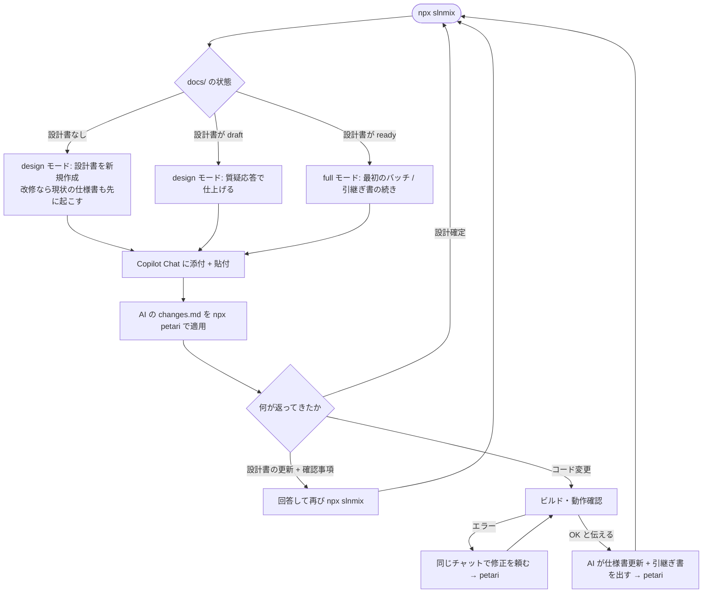

# slnmix + petari + M365 Copilot Chat 運用ガイド

「次に何を打てばいいか」を迷ったときに開くページです。slnmix v0.14 以降
(docs/ 連携あり) を前提にしています。仕組みの背景は
[HANDOFF-slnmix-petari-2026-09.md](HANDOFF-slnmix-petari-2026-09.md) §18 に
ありますが、日常ではこのページだけで足ります。

## 0. 30 秒版

```text
初回だけ   npx petari init            (規約文 protocol.md と .petari/ を作る)
           npx slnmix --init-docs     (docs/ と slnmix.config.json の docs 設定を作る)

毎回       npx slnmix                 → repomix-output.xml と repomix-output.prompt.md ができる
           Copilot Chat: .xml を添付、.prompt.md の中身を本文に貼って送信
           AI の changes.md をダウンロード
           npx petari                 → Downloads の changes.md を自動検出して適用
           ビルド → pnpm test:all      → 失敗ならクリップボードのレポートをチャットに貼る
           手動確認は引継ぎ書の手動項目だけ → 「OK」と AI に伝える
```

自動テストが無いプロジェクト (旧 WinForms のみ等) では最後の 2 行が従来どおり
「ビルド・動作確認 → 結果を AI に伝える」になります (AI にもテストは求められません)。

設計から始めるか、実装の続きか、引継ぎ書を書くかは slnmix と AI が決めます。
あなたが打つコマンドは `npx slnmix` と `npx petari` (テストがあれば `pnpm test:all`) だけです。
web と dotnet を分けたアプリ (webview2-bridge の雛形。`.sln` は `dotnet/` の下) でも同じです。
雛形に同梱の `slnmix.config.json` (`target` と `extraRoots`) がアプリのルートにあるので、
そこで `npx slnmix` と打てばアプリのルート基準のパックになり、petari のルートと一致します。

## 1. 登場するもの

| もの | 場所 | 役割 |
|---|---|---|
| パック | `repomix-output.xml` | コード全文 + docs/ の全文書。Copilot Chat に**添付**する |
| 本文用テキスト | `repomix-output.prompt.md` | 依頼内容・今回編集する文書・ひな型・作業手順・出力規約。中身を本文に**貼る** |
| 設計書 | `docs/design/<名前>.md` | 開発の進め方と判断の根拠。1 行目の状態行で draft / ready を管理 |
| 仕様書 | `docs/spec/<名前>.md` | 実装済みの振る舞いの正本 |
| 引継ぎ書 | `docs/HANDOFF.md` | チャット間の申し送りだけ (1 ファイル固定。履歴は git) |
| changes.md | Downloads | AI の回答。コードも文書も同じ形式で、petari が適用する |
| protocol.md | プロジェクトルート | petari の出力規約 (`petari init` が生成) |
| 自動テスト | `e2e/` (screen / api / host) と `*.spec.ts` / `*.test.ts` | webview2-bridge の雛形が作る。あるプロジェクトでは AI がコードと同じ changes.md でテストも返す |
| 失敗レポート | `test-results/report.md` | `pnpm test:all` が失敗したときの Markdown。クリップボードにも入るのでそのままチャットに貼る |

添付と貼付を分ける理由: Copilot Chat は添付ファイル内の指示を「埋め込み指示」として
無視します。指示が効くのは本文だけなので、AI に従わせたいものはすべて
`.prompt.md` 側に入っています。パックは検索して参照される側です。

## 2. 全体の流れ



## 3. 場面別の手順

### 3-1. 新しい画面・機能を作り始める (設計書がない)

1. `npx slnmix` → 「モード: design (自動: 設計書がないため新規作成)」と出る
2. 新しいチャットに .xml を添付、.prompt.md を貼り、続けて「この画面を作りたい。
   資料は添付のとおり」と依頼と資料 (テーブル定義、既存画面のパック等) を渡す
3. AI が設計書の初版 (changes.md の create) と確認事項 (必須 / 後回し) を返す
4. `npx petari` で docs/design/ に保存される
5. 確認事項に答えるたびに `npx slnmix` → 同じ要領で送る。設計書は本文用テキストに
   全文が入るので、AI は差分だけを replace で返す
6. 必須の確認事項がゼロになった回で AI が「継続判定: 設計確定」と言い、仕様書の
   初版も同じ changes.md に含める。`npx petari` で保存したら設計は終わり

途中で別の画面の設計を始めたいときは `npx slnmix --design 画面名` で新規作成。
draft の設計書が 2 つ以上あるときは `--design <名前>` で対象を指定します。

### 3-2. 実装を進める (設計書が ready)

1. `npx slnmix` → 「モード: full (自動: 設計書が ready ...)」と出る。引継ぎ書があれば
   「続きから」、なければ最初のバッチから
2. 新しいチャットに添付 + 貼付。依頼文は既定で入っているので、追加で言うことは
   通常ありません
3. AI が changes.md (コードと、テストがあるプロジェクトならテストも) を返す →
   `npx petari` → ビルド → `pnpm test:all`
4. ビルドエラーなら同じチャットでエラー内容を、テストが失敗したらクリップボードに
   入っている失敗レポート (`test-results/report.md`) を貼って修正を頼む (→ 3 に戻る)
5. 全件通ったら、手動確認は引継ぎ書 (設計書 §9 の「完了条件: 手動確認」) の項目だけ
   行い、「ビルド OK、テスト OK、手動確認 OK」と伝える。AI はその回答で仕様書の更新と
   引継ぎ書の書き直しを changes.md で返し、チャット移行を案内する。テストが無い
   プロジェクトでは従来どおり「ビルド OK、動作確認 OK」
6. `npx petari` → `npx slnmix` → 新しいチャットへ (→ 1 に戻る)

続けて同じチャットで次のバッチをやりたいときは「このチャットで続ける」と言えば
続きます。

### 3-3. 既存プロジェクトを乗せ替える (設計書と引継ぎ書を手動添付している)

1. `npx slnmix --init-docs` (一回だけ)
2. 設計書を `docs/design/<名前>.md` にコピーし、**1 行目**に状態行を足す。実装中なら
   ready。後回しの件数は未回答の確認事項を数える (分からなければ 0 で可)

   ```text
   <!-- slnmix design: status=ready blocking=0 deferred=3 -->
   ```

3. **最新の**引継ぎ書 1 通を `docs/HANDOFF.md` にコピーする。古い引継ぎ書は docs/ の
   外へ。中の規約や手順のコピーは消してよい (slnmix が毎回付ける)
4. `npx slnmix` → 「文書: 設計書 1 件 [ready ...] / 仕様書 0 件 / 引継ぎ書あり」
   「モード: full (自動: ... 続きから)」と出れば完了
5. 仕様書がないことは slnmix が AI に伝えるので、最初の回答で仕様書の初版が
   changes.md で返る。`npx petari` で保存

docs/ と slnmix.config.json は git にコミットしてください。
repomix-output.xml と .prompt.md は生成物なので .gitignore へ。

### 3-4. 完成済みプロジェクトに仕様追加する (文書が何もない)

設計書も仕様書もない既存プロジェクトを改修するときは、3-1 と同じ操作で始められます。
違いは AI が最初に作る文書です。

1. `npx slnmix --init-docs` (一回だけ)
2. `npx slnmix` → 「モード: design (自動: 設計書がないため新規作成)」
3. 新しいチャットに添付 + 貼付し、「この画面にこういう仕様を追加したい」と依頼する
4. AI はまず**改修対象の画面・機能に限った現状の仕様書** (as-is) をコードから起こし、
   同じ changes.md で追加仕様の設計書を出す。設計書の「1-3. 改修の場合: 現状と変更点」が
   仕様書の § を参照する形になる。`npx petari` で両方保存
5. 以降は 3-1 と同じ (確認事項に答える → 設計確定 → 実装)。実装が進むと仕様書の
   実装状況が「未」から「実装済み」に更新されていく

プロジェクト全体の仕様書を一度に起こすことはしません (量が多すぎて品質もチャットも
持たないため)。別の画面を改修するときに、その画面の仕様書が同じ要領で増えていきます。
先に全体を文書化しておきたい場合は、画面ごとに「この画面の現状の仕様書を起こして」と
依頼して `npx petari` で保存していけば、後の改修が速くなります。

### 3-5. AI から「継続判定」が返ってきたとき

| 表示 | 意味 | あなたがすること |
|---|---|---|
| 継続判定: 継続 | このチャットで続ける | そのまま次の依頼や回答を送る |
| 継続判定: 引継ぎ | バッチ完了。引継ぎ書の changes.md が一緒に返っている | `npx petari` → `npx slnmix` → 新しいチャットへ。続けたければ「このチャットで続ける」 |
| 継続判定: 引継ぎ推奨 (理由) | changes.md 3 回以上 / 失敗レポート 2 回 / パック再添付 のどれか | 切り替えるなら「引継ぎ書を出して」と頼む。続けるなら続ける |
| 継続判定: 設計確定 | 必須の確認事項ゼロ (design モード) | `npx petari` → `npx slnmix` → 新しいチャットで実装開始 |

「引継ぎ」の条件である「ビルドと動作確認の成功」は、自動テストがあるプロジェクトでは
「`pnpm test:all` が全件成功し、引継ぎ書の手動項目も OK」と読み替えます。テストが
1 本でも落ちているうちは修正のラリー (継続) です。

同じエラーに 2 回以上失敗しているときは、失敗した試行が残るチャットより、
修正途中のコードを含む最新パックで始め直す方が早いことが多いです。途中で引き継ぐと
引継ぎ書に「未解決のエラーと試したこと」が残るので、次のチャットは同じ試行を
繰り返しません。

### 3-6. petari が失敗したとき

失敗レポートは既定でクリップボードにコピーされます。そのままチャットに貼れば AI が
修正版の changes.md を返します。2 回続けて失敗したら、AI が見ているパックと手元の
コードがずれています。`npx slnmix` でパックを作り直し、新しいチャットで始めてください
(引継ぎ推奨が出ます)。

## 4. コマンド早見表

```text
npx slnmix                         パックと本文用テキストを作る (モード・依頼文は自動)
npx slnmix --task "依頼文"         依頼文を自分で指定する (既定文の代わり)
npx slnmix --design 画面名         その設計書を新規作成 / 継続する design モード
npx slnmix --mode plan             方針だけ先に出させる
npx slnmix --print-prompt | clip   本文用テキストを直接クリップボードへ (Windows。Mac は pbcopy)
npx slnmix --init-docs             docs/ 連携の初回セットアップ (冪等)

npx petari                         Downloads の changes.md を適用
npx petari undo                    直前の適用を巻き戻す
npx petari show                    直前の適用の差分を表示
npx petari init                    規約文 protocol.md と .petari/ を作る (初回のみ)
```

## 5. よくある迷い

- **モードが思っていたのと違う** → `npx slnmix` の「文書:」「モード:」の行を見る。
  設計書の状態行 (1 行目) が draft か ready かで決まる。手で直してよい
- **設計書に状態行がない** → 警告が出て ready 扱いになる。1 行目に足す
- **draft の設計書が複数ある** → `--design <名前>` で対象を指定する
- **AI が継続判定を書かない** → 「継続判定は?」と聞く。手順文は本文に貼った
  .prompt.md 側にあるので、貼り忘れると出ない
- **引継ぎ書が古い** → AI が出した changes.md を petari で当てていない。Downloads を確認
- **本文用テキストが 120K 文字を超えた** (警告が出る) → 設計書を分割するか、
  design モード以外では設計書は本文に入らないので、設計を確定させて実装に進む
- **`--mode design` でエラー** → docs/ 連携が要る。`npx slnmix --init-docs`
